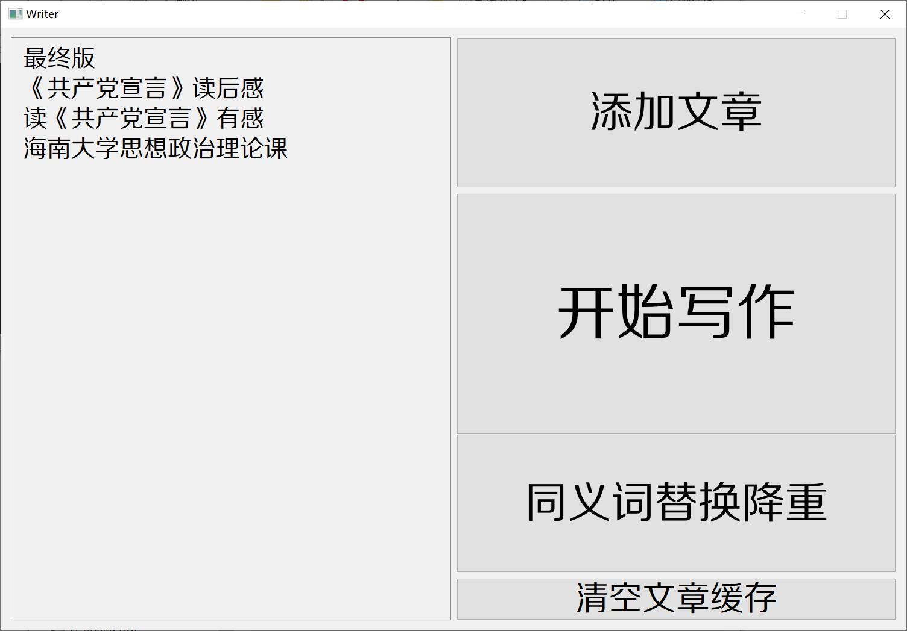
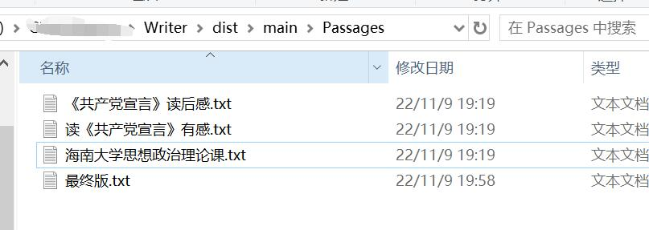
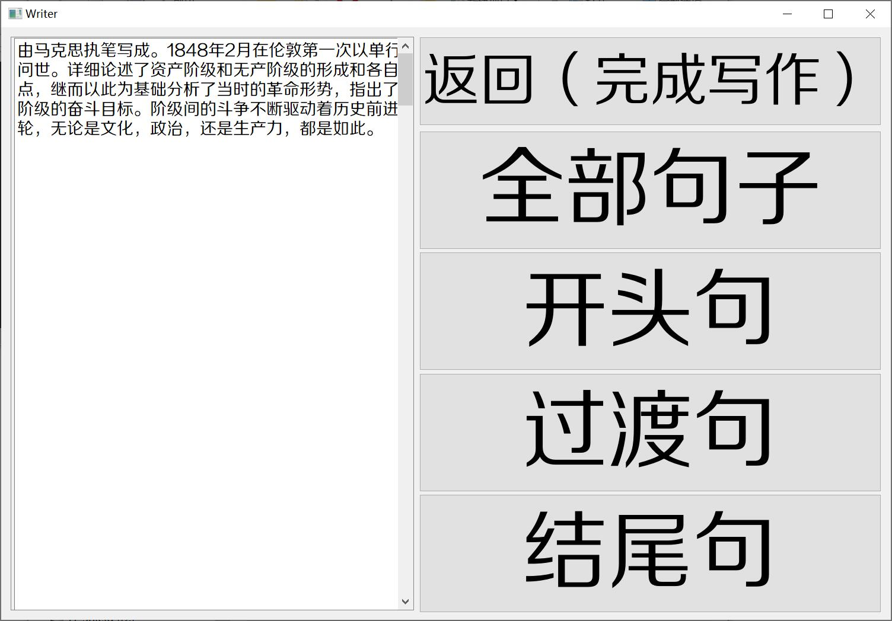
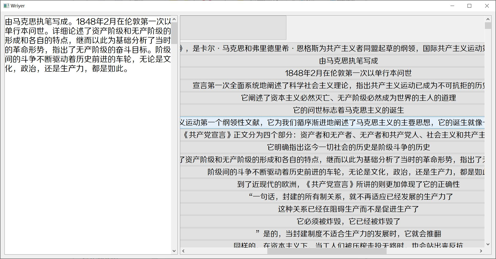
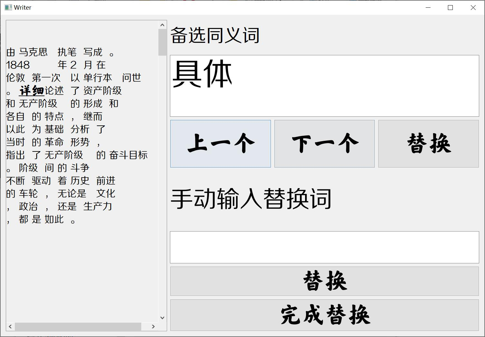
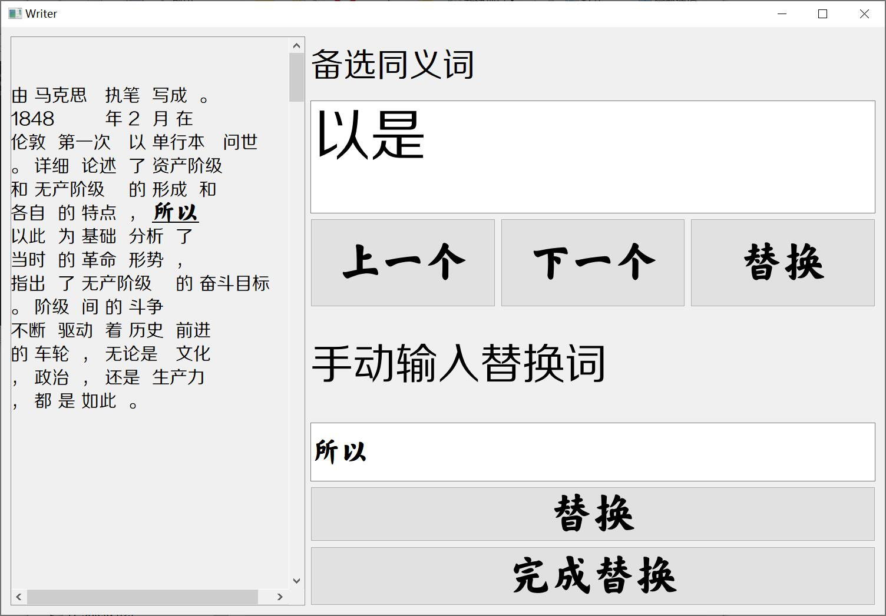

# 文章缝合器

根目录下文件为源代码。dist/main/main.exe为打包好的可执行文件。

”添加文章“功能原本可以进行百度文库文章爬取，现在已无法使用。

若需添加文章，则需要将文章的txt文件放置Passages目录下。

# 开始写作

单机”开始写作“，可以从已准备文章中抽取句子加入到新文章中。

# 同义词替换降重

可以将文章中的部分词语替换为同义词，有两种替换模式：查同义词表或者由用户手动输入想替换为的词。

